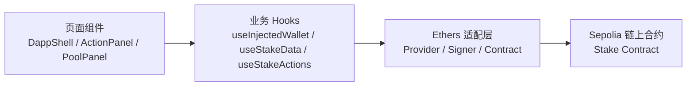
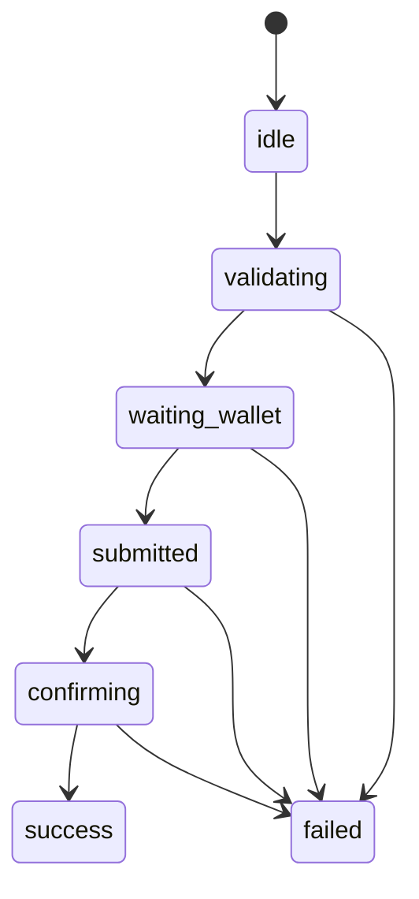
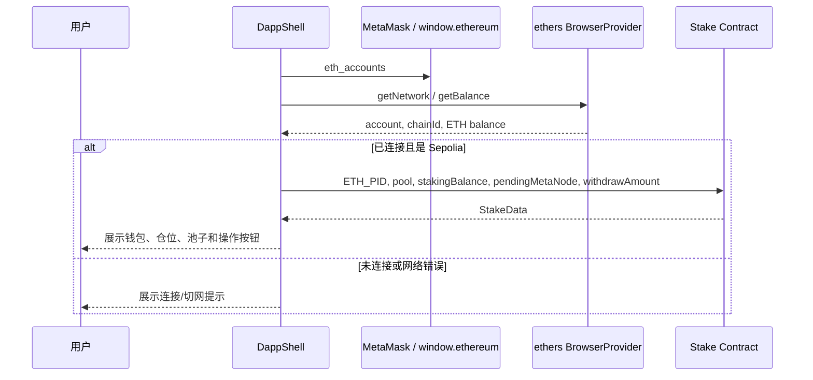
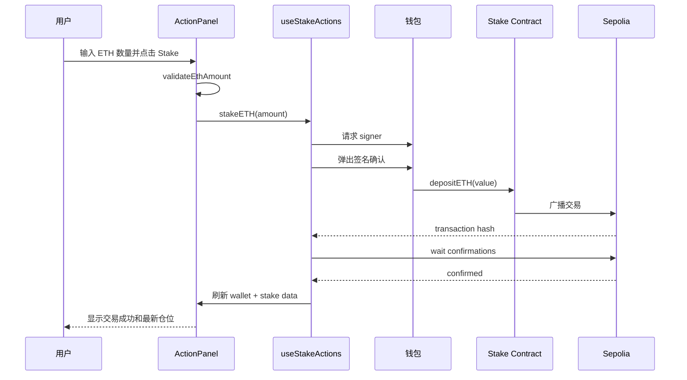

# DeFi Staking 应用实现逻辑复盘

本文基于当前 `zeroStake` 项目，复盘一个类似 DeFi 质押应用从业务模型到前端实现的核心原理。重点不是逐行解释 UI，而是把“钱包、合约、链上数据、交易状态、风控校验”这些概念串起来，方便以后实现相似的 staking、lending、farm、vault 类应用时复用。

## 1. 应用在做什么

这个项目实现的是一个 Sepolia 测试网上的 ETH staking dApp。用户连接钱包后，可以把 Sepolia ETH 质押进合约，等待区块产生 MetaNode 奖励；也可以提交解除质押请求，等锁定区块结束后提取 ETH；奖励可以单独领取。

从用户角度看，核心流程是：

1. 连接钱包并确认当前网络是 Sepolia。
2. 读取钱包 ETH 余额、用户质押数量、可领取奖励、提现请求状态。
3. 输入 ETH 数量并发起质押交易。
4. 发起解除质押请求，等待合约设置的锁定区块结束。
5. 提取已解锁 ETH。
6. 领取 MetaNode 奖励。

从工程角度看，应用可以拆成四层：



## 2. 核心业务模型

### 2.1 质押池

合约里把不同资产或不同池子抽象成 pool。当前项目只使用 ETH 池，池子 ID 通过 `ETH_PID()` 从合约读取，而不是在前端写死。

池子信息来自 `pool(pid)`，前端关心这些字段：

| 字段 | 含义 |
| --- | --- |
| `stTokenAddress` | 池子对应的质押资产地址；ETH 池可能使用特殊地址或合约内部约定 |
| `poolWeight` | 池子权重，用于多池奖励分配 |
| `lastRewardBlock` | 上次结算奖励的区块 |
| `accMetaNodePerST` | 每单位质押资产累计奖励，常见于 MasterChef 类模型 |
| `stTokenAmount` | 池子总质押量 |
| `minDepositAmount` | 最小质押数量 |
| `unstakeLockedBlocks` | 解除质押后需要等待的锁定区块数 |

这里最关键的是：前端不自己计算池子状态，而是把合约作为事实来源。UI 只是把合约状态转换成人能理解的面板。

### 2.2 用户仓位

用户仓位由几类链上数据组成：

| 数据 | 合约方法 | 页面含义 |
| --- | --- | --- |
| 钱包余额 | `provider.getBalance(account)` | Wallet ETH |
| 已质押数量 | `stakingBalance(pid, account)` | Staked ETH |
| 待领取奖励 | `pendingMetaNode(pid, account)` | Claimable META |
| 解除质押请求数量 | `withdrawAmount(pid, account).requestAmount` | Requested ETH |
| 可提现数量 | `withdrawAmount(pid, account).pendingWithdrawAmount` | Unlocked ETH |

其中 `requestAmount` 和 `pendingWithdrawAmount` 体现了 staking 合约常见的两阶段提现模型：

1. `unstake(pid, amount)`：用户先提交解除质押请求。
2. 合约等待 `unstakeLockedBlocks` 个区块。
3. `withdraw(pid)`：到期后用户把已解锁的 ETH 取回。

这种设计可以减少资金池流动性被瞬间抽空的风险，也是 DeFi staking、vault、restaking 产品里常见的退出机制。

### 2.3 奖励模型

奖励 token 是 MetaNode，合约通过 `MetaNode()` 暴露奖励 token 地址，通过 `MetaNodePerBlock()` 暴露每个区块释放的奖励数量。

页面展示的 `pendingReward` 来自合约的 `pendingMetaNode(pid, account)`。这说明奖励计算逻辑在合约里，而不是前端里。前端只负责：

1. 查询可领取奖励。
2. 显示格式化后的 META 数量。
3. 用户点击领取时调用 `claim(pid)`。

这是 DeFi 前端的重要原则：资产余额、奖励、债务、份额、可赎回数量等都应该来自链上或可信索引服务，不能只依赖前端本地计算。

## 3. 钱包连接与网络识别

项目用两套能力配合完成钱包体验：

1. `@janily/walletbridgekit` 提供通用连接按钮、链切换器和钱包状态展示。
2. `useInjectedWallet` 直接读取 `window.ethereum`，维护当前业务需要的账户、链 ID、余额和错误状态。

核心方法在 `src/hooks/useInjectedWallet.ts`：

| 方法 | 作用 |
| --- | --- |
| `getEthereum()` | 从浏览器环境读取注入钱包对象，比如 MetaMask |
| `eth_accounts` | 静默读取已授权账户，不弹授权框 |
| `eth_requestAccounts` | 主动请求用户授权连接钱包 |
| `provider.getNetwork()` | 读取当前链 ID |
| `provider.getBalance(account)` | 读取用户原生 ETH 余额 |
| `wallet_switchEthereumChain` | 请求钱包切换到 Sepolia |

网络判断使用 `SEPOLIA_CHAIN_ID = 11155111n`。只有用户已连接且网络正确时，`useStakeData` 才会读取合约数据，操作按钮才允许交易。

这种 gating 很重要。因为同一个合约地址在不同链上可能完全不是同一个合约，甚至没有部署。DeFi 前端必须明确链环境，否则用户容易在错误网络上签名或看到错误状态。

## 4. Ethers 适配层

`src/lib/ethers.ts` 把和 ethers 相关的底层对象集中封装：

```ts
getBrowserProvider() // 基于 window.ethereum 创建 BrowserProvider
getSigner()          // 获取当前钱包签名者
getStakeContract()   // 用 ABI + 合约地址 + runner 创建 Contract
```

这里的 `runner` 可以是 provider，也可以是 signer：

| runner | 用途 | 是否需要用户签名 |
| --- | --- | --- |
| `BrowserProvider` | 读取链上数据，例如 `pool()`、`pendingMetaNode()` | 否 |
| `Signer` | 发送交易，例如 `depositETH()`、`claim()` | 是 |

这也是所有 EVM dApp 的基本分界：

1. `view` / `pure` 方法是读操作，不消耗 gas，不需要签名。
2. `payable` / `nonpayable` 写操作会改变链上状态，需要钱包签名并消耗 gas。

## 5. 链上数据读取逻辑

数据读取集中在 `src/hooks/useStakeData.ts`。

`loadStakeData(account, contract)` 会并行读取合约状态：

```ts
const [
  ethPid,
  paused,
  claimPaused,
  withdrawPaused,
  metaNodeAddress,
  metaNodePerBlock,
  startBlock,
  endBlock,
] = await Promise.all([...]);
```

然后继续读取和用户相关的数据：

```ts
const [poolRaw, stakingBalance, pendingReward, withdrawRaw] = await Promise.all([
  contract.pool(ethPid),
  contract.stakingBalance(ethPid, account),
  contract.pendingMetaNode(ethPid, account),
  contract.withdrawAmount(ethPid, account),
]);
```

这里有两个实现细节值得复用：

1. 使用 `Promise.all` 并发读链，减少页面等待时间。
2. 同时兼容 ethers 返回的命名字段和数组下标字段，例如 `poolRaw.stTokenAddress ?? poolRaw[0]`。

读取完成后，数据被整理成 `StakeData` 类型。组件不直接处理合约返回的松散结构，而是消费一个稳定的业务对象。这能降低 UI 和 ABI 细节之间的耦合。

## 6. 写交易逻辑

写交易集中在 `src/hooks/useStakeActions.ts`。四个业务动作分别映射到四个合约方法：

| 页面动作 | 业务函数 | 合约调用 |
| --- | --- | --- |
| Stake ETH | `runStakeETH` | `depositETH({ value })` |
| Request Withdraw | `runRequestWithdraw` | `unstake(pid, amount)` |
| Withdraw Unlocked ETH | `runWithdrawUnlockedETH` | `withdraw(pid)` |
| Claim Rewards | `runClaimReward` | `claim(pid)` |

ETH 质押比较特殊，因为 ETH 是原生币，不是 ERC20。调用 `depositETH` 时，需要把金额放进交易 overrides 的 `value` 字段：

```ts
contract.depositETH({ value: parseEther(amount) });
```

如果是 ERC20 staking，常见流程会多一步：

1. `approve(stakingContract, amount)` 授权合约转走 token。
2. `deposit(pid, amount)` 或 `stake(amount)` 执行质押。

当前项目是 ETH staking，所以不需要 ERC20 `approve`。

### 6.1 交易状态机

`useStakeActions` 维护了一个简单但实用的交易状态机：



每个状态对应用户能理解的文案：

| 状态 | 含义 |
| --- | --- |
| `validating` | 前端准备交易、校验输入 |
| `waiting_wallet` | 已唤起钱包，等待用户确认 |
| `submitted` | 交易已广播到链上，拿到 hash |
| `confirming` | 等待区块确认 |
| `success` | `transaction.wait()` 完成 |
| `failed` | 用户拒签、合约 revert、估算 gas 失败等 |

这套状态机对于 DeFi 产品非常重要。链上交易不是普通 HTTP 请求，用户需要经历“钱包确认、交易广播、区块确认”多个阶段。如果前端只显示 loading，很难解释到底卡在哪里。

### 6.2 交易成功后的刷新

交易确认后会执行：

```ts
await onSuccess?.();
```

在 `DappShell` 里，这个回调会同时刷新钱包余额和 staking 数据：

```ts
await Promise.all([wallet.refresh(), stakeData.refresh()]);
```

原因是一次交易可能影响多处状态：

1. `depositETH` 会减少钱包 ETH，增加 staked ETH。
2. `unstake` 会减少 staked ETH，增加 request amount。
3. `withdraw` 会增加钱包 ETH，减少 unlocked ETH。
4. `claim` 会减少 pending reward，并增加用户奖励 token 余额；当前页面没有展示奖励 token 钱包余额，但仍需要刷新合约侧状态。

## 7. 金额处理与输入校验

EVM 链上整数没有小数，ETH 的 1 个单位等于 `10^18 wei`。所以前端展示和合约调用之间必须做转换：

| 场景 | 方法 |
| --- | --- |
| 用户输入 `"0.01"` ETH 转成链上整数 | `parseEther("0.01")` |
| 链上 bigint 转成人类可读文本 | `formatEther(value)` |
| 展示时限制小数位 | `formatTokenAmount(value, digits)` |

`validateEthAmount` 做了几件事：

1. 去掉首尾空格。
2. 确认是合法数字。
3. 用 `parseEther` 转成 bigint。
4. 要求数量大于 0。
5. 如果传入 `max`，不能超过最大值。
6. 如果传入 `min`，不能低于最小值。

质押时的最大值不是完整钱包余额，而是：

```ts
maxStakeAmount(balance) = balance - GAS_RESERVE
```

`GAS_RESERVE` 当前是 `0.005 ETH`。这是为了避免用户把钱包 ETH 全部质押进去后，连后续 unstake、withdraw、claim 的 gas 都付不起。

这也是 DeFi 前端常见的用户保护：前端校验不能代替合约校验，但可以提前阻止明显失败的交易，减少用户浪费 gas 或遇到难懂的 revert。

## 8. 暂停状态与按钮禁用

合约提供了几个暂停开关：

| 状态 | 影响 |
| --- | --- |
| `paused` | 合约整体或质押相关功能暂停 |
| `claimPaused` | 领取奖励暂停 |
| `withdrawPaused` | 解除质押或提现暂停 |

`ActionPanel` 根据这些状态禁用按钮：

```ts
stakeDisabled = baseDisabled || invalidAmount || data?.paused
requestDisabled = baseDisabled || invalidAmount || data?.withdrawPaused
withdrawDisabled = baseDisabled || noUnlockedAmount || data?.withdrawPaused
claimDisabled = baseDisabled || noPendingReward || data?.claimPaused
```

`baseDisabled` 又包含：

1. 钱包未连接。
2. 网络不正确。
3. 当前已有交易正在处理中。

这个模式可以复用到几乎所有 DeFi 应用：按钮是否可点应该由“钱包状态、网络状态、输入合法性、合约状态、交易忙碌状态”共同决定。

## 9. 错误处理

链上错误通常对用户不友好，例如：

1. 用户拒绝签名：`4001`、`user rejected`
2. 合约暂停：`EnforcedPause`
3. 权限错误：`AccessControlUnauthorizedAccount`
4. ERC20 操作失败：`SafeERC20FailedOperation`
5. gas 估算失败：`estimateGas`、`missing revert data`

项目用 `toReadableError` 把这些底层错误转成中文提示。这样组件层只关心 `tx.error`，不用理解钱包和合约返回的各种错误格式。

实现类似 DeFi 应用时，建议把错误处理单独抽成一层，并持续积累常见错误映射。否则页面里会散落很多难维护的字符串判断。

## 10. ABI、地址与环境配置

前端通过 ABI 知道合约有哪些方法、方法参数是什么、返回值是什么。当前项目只保留了前端需要的方法，放在 `src/contracts/stakeAbi.ts`。

合约地址来自：

```ts
process.env.NEXT_PUBLIC_STAKE_ADDRESS || 默认 Sepolia 地址
```

这说明部署到不同环境时，可以通过环境变量切换合约地址，而不用改代码。

需要注意：`NEXT_PUBLIC_` 前缀表示这个变量会被打包进浏览器代码，不能放私钥、管理员 key、RPC 密钥等敏感信息。合约地址、公开 RPC、项目 ID 一类公开配置可以放这里。

## 11. 当前项目的数据流

一次页面加载时，大致流程如下：



一次质押交易的流程如下：



## 12. 可复用的方法论

实现类似 DeFi 前端时，可以按下面的顺序设计：

1. 明确业务动作：用户能做哪些操作，每个操作对应哪个合约方法。
2. 明确链上读模型：页面要展示哪些状态，每个状态来自哪个 view 方法。
3. 明确网络和地址：支持哪些 chain，每个 chain 的合约地址是什么。
4. 封装 provider、signer、contract：把 ethers 或 viem 的底层细节集中管理。
5. 拆分读 Hook 和写 Hook：读数据负责查询和刷新，写交易负责状态机和错误处理。
6. 用 bigint 处理链上金额：不要用 JavaScript number 表示 token 数量。
7. 输入先校验再发交易：校验格式、最大值、最小值、余额和暂停状态。
8. 显示完整交易生命周期：等待钱包、已提交、确认中、成功、失败。
9. 交易成功后刷新所有受影响状态：钱包余额、用户仓位、池子数据、奖励数据。
10. 把错误翻译成人话：用户不应该直接看到底层 revert 或 RPC 错误。

## 13. 和其它 DeFi 类型的对应关系

虽然当前项目是 staking，但模式可以迁移：

| 类型 | 读数据 | 写交易 | 特殊点 |
| --- | --- | --- | --- |
| Staking | 已质押、可领取奖励、提现请求 | stake、unstake、withdraw、claim | 奖励和锁定期 |
| Lending | 存款、借款、抵押率、健康因子 | supply、borrow、repay、withdraw | 清算风险和价格预言机 |
| Vault | 用户 shares、资产净值、可赎回数量 | deposit、redeem、withdraw | share 与 asset 换算 |
| DEX Swap | 余额、报价、滑点、路径 | approve、swap | 价格影响和最小收到数量 |
| Farming | LP 数量、奖励、池权重 | deposit LP、withdraw LP、harvest | LP token 授权和多奖励 |

它们的共同点是：前端不是资产账本本身，而是链上合约的交互层。真正可信的状态在链上，前端负责把复杂状态组织成清晰、安全、可操作的用户体验。

## 14. 本项目的关键文件索引

| 文件 | 作用 |
| --- | --- |
| `src/components/DappShell.tsx` | 页面总装配，连接钱包、数据读取、操作面板 |
| `src/hooks/useInjectedWallet.ts` | 钱包账户、网络、余额、切网逻辑 |
| `src/hooks/useStakeData.ts` | 读取池子、用户仓位、奖励、暂停状态 |
| `src/hooks/useStakeActions.ts` | 质押、解除质押、提现、领奖的交易状态机 |
| `src/lib/ethers.ts` | provider、signer、contract 创建 |
| `src/lib/validate.ts` | ETH 金额校验、gas 预留 |
| `src/lib/format.ts` | 地址、hash、token 金额格式化 |
| `src/lib/errors.ts` | 钱包和合约错误的人类可读转换 |
| `src/contracts/stakeAbi.ts` | 前端调用合约所需 ABI |
| `src/contracts/addresses.ts` | stake 合约地址配置 |
| `src/types/stake.ts` | 池子、用户仓位、交易状态类型 |

## 15. 复盘重点

这个项目的核心不是“做了几个按钮”，而是建立了一套 DeFi 前端的基础骨架：

1. 钱包是身份和签名入口。
2. 网络决定合约地址是否有效。
3. ABI 是前端理解合约的接口描述。
4. Provider 用来读链，Signer 用来写链。
5. 链上金额必须用 bigint 和 decimals 转换。
6. 交易有生命周期，不能当作普通异步请求处理。
7. 合约状态是事实来源，前端只做展示、校验和交互编排。
8. 好的 DeFi 前端会提前处理网络、余额、暂停、最小值、最大值、gas 预留和错误提示。

掌握这些之后，再实现 lending、vault、farm、swap 等应用时，差异主要在合约方法和风险参数，前端架构仍然可以沿用这套分层。
